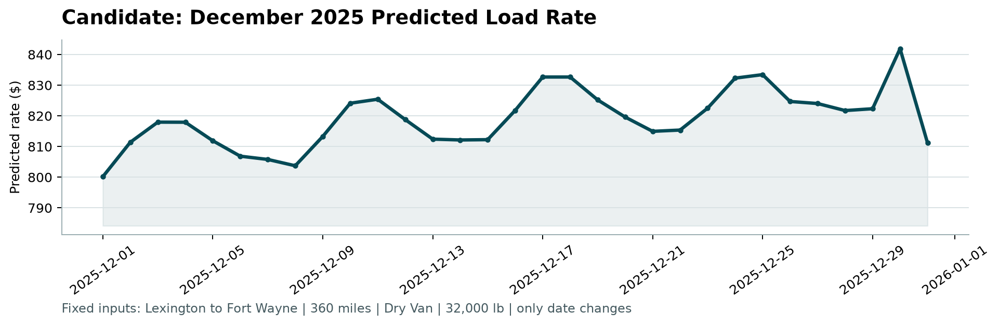

# Spotter Freight Rate ML Prediction

Machine learning solution for Spotter's Freight Rate Prediction Challenge. Predicts commercial freight spot rates (`posted_rate`) across US freight corridors and generates benchmark forecasts for the official scorer.

---

## 📊 Model Results (Out-of-Time Holdout)

Validated using a strict temporal holdout (**Jan 1 – Aug 31 train** vs. **Sep 1 – Oct 31 validation**) simulating the exact 2-month test horizon:

| Model | Architecture | Target | Val MAE ($) | Val RMSE ($) | Val R² | Status |
| :--- | :--- | :---: | :---: | :---: | :---: | :---: |
| **Ridge (Baseline)** | Scaled Ridge ($\alpha=10.0$) | $\log(1 + \text{rate})$ | $452.52 | $946.61 | 0.6152 | Baseline |
| **XGBoost** | 700 trees, depth 6, lr=0.04 | $\log(1 + \text{rate})$ | $124.79 | $638.05 | 0.8252 | Evaluated |
| **LightGBM** | 700 trees, 31 leaves, lr=0.04 | $\log(1 + \text{rate})$ | $120.34 | $634.24 | 0.8273 | Evaluated |
| **Ensemble (CB+LGB+XGB)** | Equal-weighted tri-blend | $\log(1 + \text{rate})$ | $112.59 | $633.49 | 0.8277 | Evaluated |
| **Ensemble (LGB+CB)** | 50/50 dual blend | $\log(1 + \text{rate})$ | $110.10 | $632.63 | 0.8281 | Evaluated |
| **CatBoost (Winning Model)** | **700 trees, depth 6, lr=0.05** | $\mathbf{\log(1 + \text{rate})}$ | **$105.96** | **$632.54** | **0.8282** | **Selected** |

---

## ⚡ Quickstart Instructions

### 1. Install Dependencies
```bash
pip install -r requirements.txt
```

### 2. Run CatBoost Evaluation Only (Fastest)
To quickly evaluate **only the winning CatBoost model** on the out-of-time validation split:
```bash
python src/evaluate_catboost.py
```
*Expected output: Validation MAE: **$105.96** | Validation RMSE: **$632.54** | Validation R²: **0.8282***

### 3. Run All Models Benchmark (Optional)
To reproduce the full comparison table across Ridge, LightGBM, XGBoost, CatBoost, and Ensembles:
```bash
python src/evaluate_models.py
```

### 4. Retrain & Generate Final Predictions
To train the optimal CatBoost model on all 48,000 historical loads, generate `validation_predictions.csv`, predict the December benchmark route, and run the official scorer:
```bash
python src/train_predict_submit.py
```

### 5. Run Official Scorer
To verify the submission files with Spotter's official validator:
```bash
python score.py --predictions validation_predictions.csv --december-predictions december-chart-inputs.csv
```
Expected output:
```text
Validated 12,000 final predictions.
Validated 31 fixed December predictions.
Created chart: scorer_results/candidate_december.png
Final validation metrics are calculated by Spotter after submission.
```

---

## 🧠 Key Methodology

1. **Temporal Validation (Zero Leakage):** Out-of-time holdout (Jan–Aug train, Sep–Oct val) avoids look-ahead bias and directly mirrors the 2-month Nov–Dec test horizon.
2. **Handling Unseen Test Geography:** The test set contains 8 new cities and 736 unseen lanes. The model avoids discrete city IDs and uses continuous spatial coordinates (`pickup_lat/lon`, `delivery_lat/lon`), Haversine distances, route circuity ratios, bearings, and midpoints.
3. **Target Formulation:** Predicting $\log(1 + \text{rate})$ rather than raw dollars improved out-of-time MAE by $18.95/load.
4. **Data Hygiene:** Negative weights were corrected via `abs(weight)` + median imputation. Volatile short-term market index signals were excluded to avoid regime overfitting.

---

## 📈 December Benchmark Chart

Generated by `score.py` for Lexington to Fort Wayne (360 miles, Dry Van, 32,000 lbs):



* **Rates:** $800.17 to $841.83 (effective $2.22 to $2.34 / mile).
* **Dynamics:** Mid-week commercial volume surges, weekend troughs, and an end-of-year pre-holiday capacity squeeze peaking on December 29–30.
